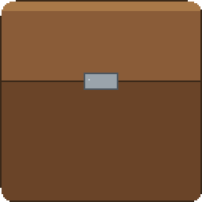

  

# Minecraft Utilities

<!-- prettier-ignore-start -->
<!-- markdownlint-disable-next-line MD036 -->
_✨ Practical tools for Minecraft players · local-first ✨_
<!-- prettier-ignore-end -->

Powered by [Tauri 2](https://tauri.app/) · [Vue 3](https://vuejs.org/) · [Python 3](https://www.python.org/)

绝赞开发中 🎉……

[简体中文](./README.md) | [English](./README.en.md)

## 📖 使用须知

这是一个**正在快速迭代**的项目，可能会有一些小 BUG 出没 🐛（我们会努力消灭它们的！）

遇到问题？欢迎来提 **[Issue](https://github.com/Lexcubia/Minecraft-Utilities/issues)** 反馈。更多好玩的功能正在路上，敬请期待 ✨

> 💡 **提示**：发行版自动更新能力在路线图中规划；当前阶段请从源码或 CI 产物体验，详见 [使用说明](docs/zh-cn/USAGE.md)。

## 🏗️ 架构一览

- **桌面壳**：[Tauri 2](https://tauri.app/)
- **界面与构建**：[Vue 3](https://vuejs.org/) · [Vite](https://vitejs.dev/) · [TypeScript](https://www.typescriptlang.org/) · [Tailwind CSS](https://tailwindcss.com/) · [Vuetify](https://vuetifyjs.com/)（Material）
- **状态与路由**：[Pinia](https://pinia.vuejs.org/) · [Vue Router](https://router.vuejs.org/)
- **核心引擎**：[Python 3](https://www.python.org/)（业务逻辑、网络与文件；配套库见 [架构说明](docs/ARCHITECTURE.md)）
- **Tauri 底层**：[Rust](https://www.rust-lang.org/)（由 Tauri 工具链管理，一般无需单独编写）

更完整的分层、目录与接口约定 👉 [docs/ARCHITECTURE.md](docs/ARCHITECTURE.md)

## ✨ 功能一览

- **方向**：围绕 **Minecraft Utilities** 逐步提供多款**本机实用能力**（桌面 Tauri + Python 引擎）。
- **当前主线**：在常见启动器、**.minecraft/versions/** 版本隔离前提下，用作者发布的 **zip / mrpack** 对齐实例中的模组与清单；**先预览（dry-run）再应用**；**操作前请自行备份**。
- **格式**：兼容 **CurseForge** 与 **Modrinth** 官方包格式。

细节与路线图 👉 [产品设计](docs/PRODUCT.md) · [路线图](docs/ROADMAP.md)

## 🛠️ 开发者指南

想参与开发或深入了解项目？来这里吧 👉 **[中文文档索引](docs/zh-cn/README.md)** · **[AGENTS.md](AGENTS.md)**

欢迎各路大佬贡献代码，一起把 **Minecraft Utilities** 变得更好！💪

## 💖 感谢贡献者

感谢所有添砖加瓦的开发者们！🎉 你们都是最棒的！

### 维护者

  

有你们的贡献，项目才能变得越来越好~ ❤️
