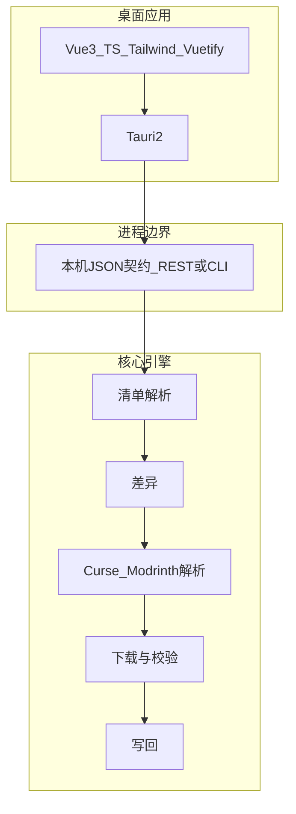

# 架构说明

本文描述 **Minecraft Utilities** 的**目标技术架构**，用于对齐开发与代码审查；与当前仓库是否已有代码无关。

- 用户向文档入口：[中文文档索引（zh-cn）](zh-cn/README.md)
- 仓库首页（仅架构 + 功能）：[README](../README.md)

---

## 分层



- **核心引擎**：解析 `manifest.json` / `modrinth.index.json`（含从 zip、`.mrpack` 读取）、调用平台 API、计算差异、下载并校验、写回 `mods/` 与清单；**业务规则集中在此**，不在 Vue 中复制。
- **桌面壳**：Tauri 2 负责窗口、文件对话框、单实例、（可选）拉起引擎 sidecar。
- **前端**：**Vite** + **Vue 3** + **TypeScript** + **Tailwind CSS** + **Vuetify**（Material Design 组件），通过**本机 HTTP（推荐）**或 **CLI `--json`** 与引擎交互；类型可与引擎 OpenAPI 对齐。

---

## 前端技术栈（仓库根）

**Tauri 2** 壳；**Vite** 构建；**Vue 3** + **TypeScript**；样式层 **Tailwind CSS**；界面 **Vuetify**（`vite-plugin-vuetify` 按需、`createVuetify` 主题与 locale）；路由 **Vue Router**；全局状态 **Pinia**。与引擎通信以本机 HTTP（推荐）或 CLI `--json` 为主。

- **Vuetify**：表单、表格、向导步骤与 Material 风格组件；图标默认 **MDI**（`@mdi/font`）。
- **Tailwind CSS**：页面级布局（flex/grid）、间距与响应式；以组件库承载交互控件为主，避免用大量 utility 替代 Vuetify 组件。
- **数据请求**：`fetch`；需要时可用 OpenAPI 生成 TS 类型；长耗时接口（如 `plan`/`apply`）可在实现阶段再考虑进度展示或流式响应。

### 质量与工具链

- **类型**：`vue-tsc` + 严格 `tsconfig`。
- **格式与 Lint**：仓库根 **Prettier**（`prettier.config.js` 等）+ **markdownlint-cli2**；**ESLint 9 flat**（`eslint.config.ts`、`typescript-eslint`、`eslint-plugin-vue`、`eslint-config-prettier`）+ **Prettier**（`src/` 下 TS/CSS 与根目录 Vite/ESLint/Vitest 配置脚本）。
- **测试**：**Vitest** + **Vue Test Utils**。

### Tauri 侧与前端协作要点

- 系统能力（**原生文件/文件夹选择**、单实例、深链）优先 **`@tauri-apps/plugin-dialog`** 等官方插件，路径再交给引擎或 Vue 状态。
- **CSP / devServer**：按 Tauri 2 文档配置，避免生产构建引入不安全的内联脚本习惯。
- **Sidecar**：由 Rust 侧拉起 Python（或其它）引擎时，将 **动态端口** 或 **命名管道** 通过 `invoke` 注入前端，再 `fetch` 基址。

---

## 后端语言（规划默认）

默认采用 **Python 3.11+**（Typer、Pydantic、httpx；可选 FastAPI 暴露本机 REST），理由见团队内完整计划书中的「Minecraft 场景与后端选型」章节。  
若改为 **Rust** 或 **Go** 作为唯一引擎，应同步修订本文与 [路线图](ROADMAP.md) 中的目录约定与打包说明。

---

## 仓库目录（目标形态）

```text
src/                     # Vue 前端（Vite 约定）
src-tauri/               # Rust 壳（Tauri / Cargo 约定）
python/modpack_updater/  # Python 引擎包（若采用 Python）
scripts/                 # 根目录 Node 工具脚本（打包、版本同步、CI 校验等）
build/                   # 本机构建产物根（Vite/Cargo/免安装包；见 AGENTS.md，勿提交）
tests/
docs/                    # 产品、架构、路线图
docs/zh-cn/developers/   # 中文开发者索引
AGENTS.md                # Agent / 贡献者约定
```
